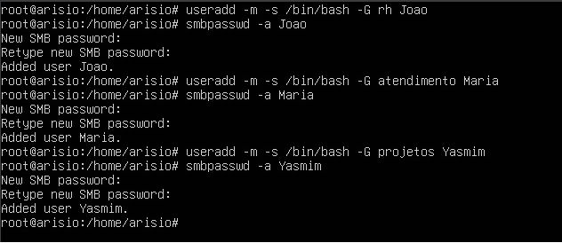
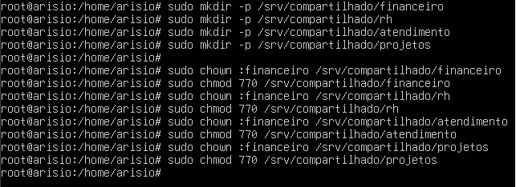
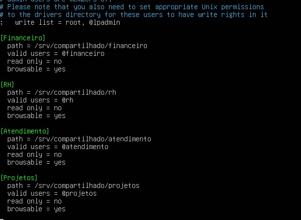
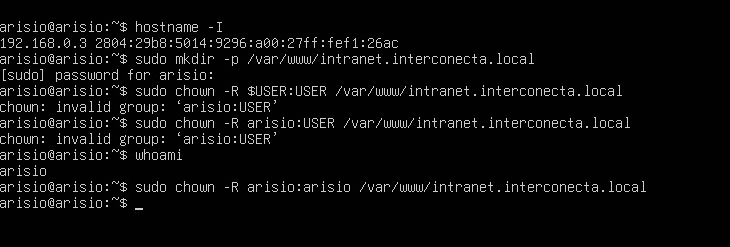
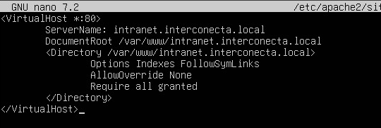

<h1 align="center">AP1 Estágio Supervisionado I - Arisio Andrade</h1> <br>

## ✅ Etapas Realizadas

1. 📦 **Instalação do VirtualBox e Ubuntu Server**
   - Foi instalado o **VirtualBox**.
   - Foi baixada e montada a **ISO do Ubuntu Server**.
   - Foi criada e configurada uma **máquina virtual** para o ambiente de rede.

2. 🔄 **Atualização do Sistema**
   - As bibliotecas do sistema foram atualizadas com os comandos:
     ```bash
     sudo apt-get update && sudo apt-get upgrade -y
     ```

3. 🧱 **Instalação e Configuração do Samba**
   - O **Samba** foi instalado com:
     ```bash
     sudo apt-get install samba -y
     ```
   - Foram criados os grupos com:
     ```bash
     sudo groupadd nome_do_grupo
     ```
   - Foram criados usuários e atribuídos aos respectivos grupos:
     ```bash
     sudo useradd -m -s /bin/bash -G nome_do_grupo nome_do_usuario
     sudo passwd nome_do_usuario
     ```
     
   - Foram criadas as pastas compartilhadas:
     ```bash
     sudo mkdir -p /srv/samba/pasta_compartilhada
     sudo chown :nome_do_grupo /srv/samba/pasta_compartilhada
     sudo chmod 2770 /srv/samba/pasta_compartilhada
     ```
     
   - Foi editado o arquivo de configuração do Samba:
     ```bash
     sudo nano /etc/samba/smb.conf
     ```
     
   - Foi adicionado o bloco de compartilhamento no final do arquivo.
   - O serviço do Samba foi reiniciado:
     ```bash
     sudo systemctl restart smbd
     ```
    
    

4. 🌐 **Instalação do Servidor Web Apache**
   - O **Apache2** foi instalado com:
     ```bash
     sudo apt-get install apache2 -y
     ```
   - O status do serviço foi verificado com:
     ```bash
     sudo systemctl status apache2
     ```

5. 🌍 **Configuração da Rede**
   - A rede da máquina virtual foi alterada de **NAT** para **Bridged Adapter**, permitindo acesso à rede local diretamente.

6. 💻 **Acesso Remoto via PuTTY**
   - Foi instalado e utilizado o **PuTTY** para facilitar o manuseio de arquivos e comandos do servidor remotamente, usando o IP fornecido pelo modo bridge.

7. 🧩 **Criação do Script PHP e Página Web**
   - Foi criado um arquivo `.php` no diretório padrão do Apache:
   

8. 🎨 **Adição de Estilo com CSS**
   - Foi criado um arquivo `style.css` com regras de estilo.
   - O arquivo CSS foi referenciado no PHP com a tag `<link>` dentro do `<head>`:
     ```html
     <link rel="stylesheet" href="styles.css">
     ```

9. 📂 **Criação de Diretório para a Aplicação Web**
   - Foi criado um novo diretório para a aplicação:
     ```bash
     sudo mkdir /var/www/intranet.interconecta.local
     ```
   - Foram atribuídas permissões:
     ```bash
     sudo chown -R $USER:$USER /var/www/intranet.interconecta.local
     sudo chmod -R 755 /var/www/intranet.interconecta.local
     ```
     

10. 🌐 **Configuração do Virtual Host**
    - Foi criado um novo arquivo de virtual host: <br>
    
    - O site foi habilitado com:
      ```bash
      sudo a2ensite meusite.conf
      sudo systemctl reload apache2
      ```

11. 🔗 **Acesso à Página Web**
    - A página foi acessada pelo navegador usando o IP da máquina virtual (modo bridge) ou nome configurado no `hosts`.

---

📌 **Observações Finais:**
- Durante a configuração, foram usados comandos de verificação como `ip a`, `ping`, `systemctl status` e `smbstatus` para garantir o funcionamento dos serviços.
- O projeto simulou a infraestrutura básica de um servidor de arquivos e de aplicação web em rede interna.

